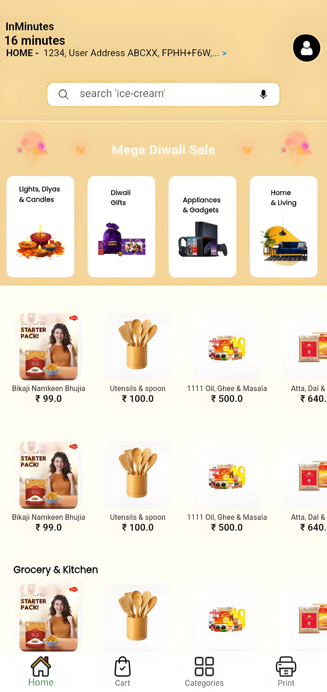
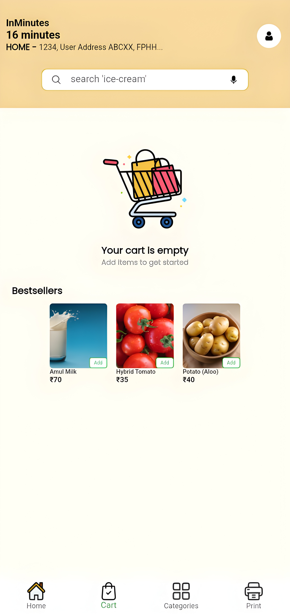
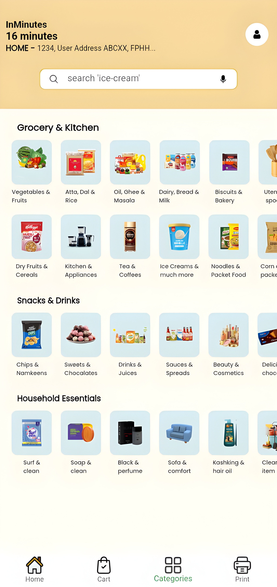
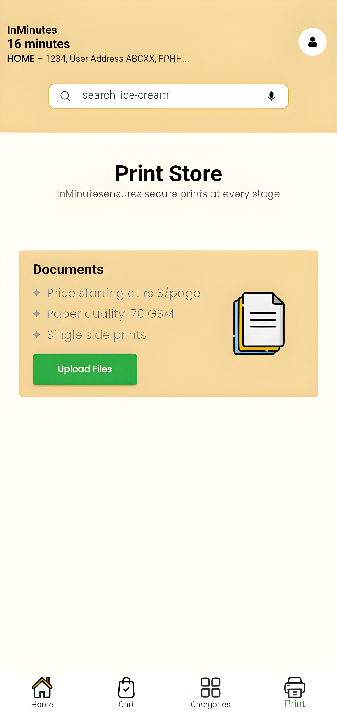

# 🚀 InMinutes - Quick Commerce App (Blinkit Clone)


**InMinutes** is a cross-platform Quick Commerce (Q-Commerce) application inspired by Blinkit. Built to bridge the gap between hyper-local inventory and digital convenience, it simulates the delivery of groceries, household essentials, and specialized printing services.

---

## 📝 Developer's Note (About This Project)

Hello! I am Alfez Khan, and **this is my very first major Flutter project.** Since this is my stepping stone into app development, my primary focus was entirely on crafting a clean, attractive, and **pixel-perfect User Interface (UI)**.

* **Learning Phase:** To implement some of the advanced responsive UI methods, I took assistance from AI tools. I am currently in the learning phase and my goal is to master these concepts deeply in my upcoming projects to become a highly skilled developer.
* **Authentication Disclaimer:** The Phone Number OTP authentication screen is a **UI simulation for demo purposes only** to give it a realistic feel. Under the hood, it uses **Firebase Anonymous Authentication** to generate user IDs. Real SMS OTP is not implemented.
* **Scope:** This project will remain as my 1st portfolio piece. It is purely a frontend and Firebase database project with no actual AI or IoT algorithms functioning in the codebase.

I am continuously learning new things every day to improve my skills and build even better architectures!

---

## ✨ Key Features

* **⚡ Hybrid Offline-First Cart Engine:** Uses `Provider` coupled with `SharedPreferences` to persist cart data locally, preventing data loss during network drops, while syncing with Cloud Firestore.
* **📍 Precision Geolocation:** Integrates `geolocator` and `geocoding` for exact coordinate extraction, reverse geocoding, and a manual Google Maps pin-drop interface.
* **🖨️ The Print Store:** A specialized service module allowing users to upload documents (via camera or local gallery using `image_picker`) for simulated doorstep physical printing.
* **🔐 Simulated Phone Auth:** A beautifully designed OTP screen with auto-fill simulation that logs users in anonymously behind the scenes.

---

## 🛠️ Technology Stack

* **Frontend:** Flutter SDK (Dart)
* **Backend as a Service (BaaS):** Firebase (Anonymous Auth, Cloud Firestore)
* **State Management:** Provider (MVVM Architecture)
* **Local Storage:** SharedPreferences
* **Testing Hardware:** Moto G34 5G (Android 14)

---

## 📱 App Interface & Flow

| Home Screen | Cart & Checkout | Category Screen | Print Screen |
| :---: | :---: | :---: | :---: |
|  |  |  |  |

---

## 🧠 Core Architecture Highlights

### 1. State Management (Cart Sync)
The app utilizes a synchronization algorithm to keep the user's cart reliable.
```dart
// Example implementation logic from CartManager
void addToCart(ProductModel product) {
  // 1. Update local state
  // 2. Save to SharedPreferences (Offline resilience)
  // 3. Sync to Firebase Cloud Firestore
  // 4. notifyListeners() for instantaneous UI rebuild
}
